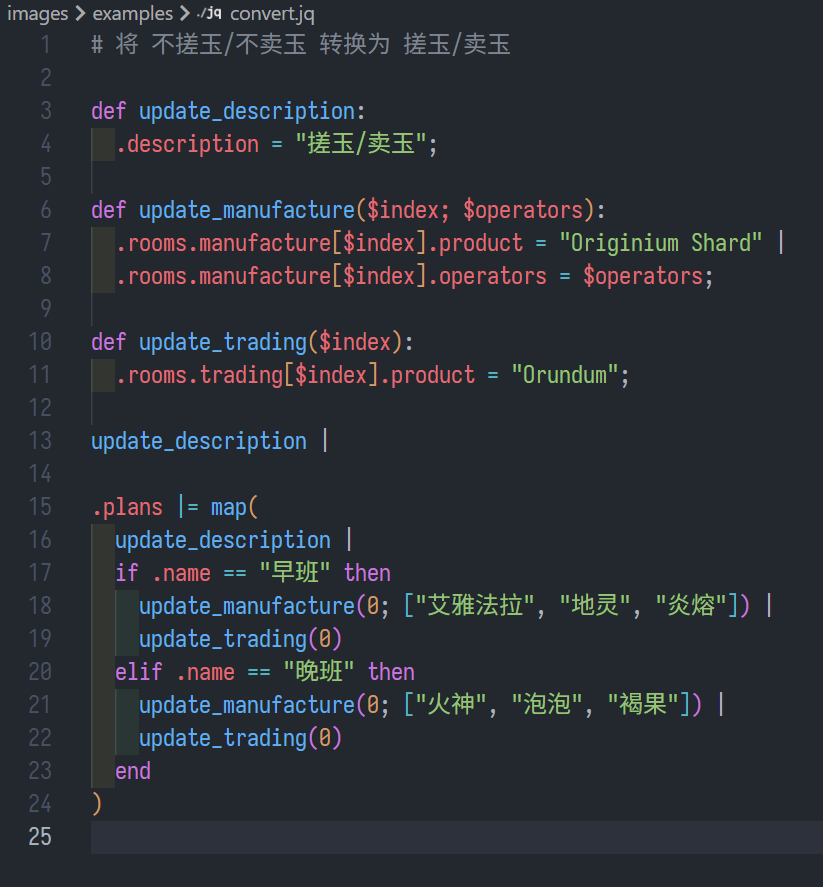
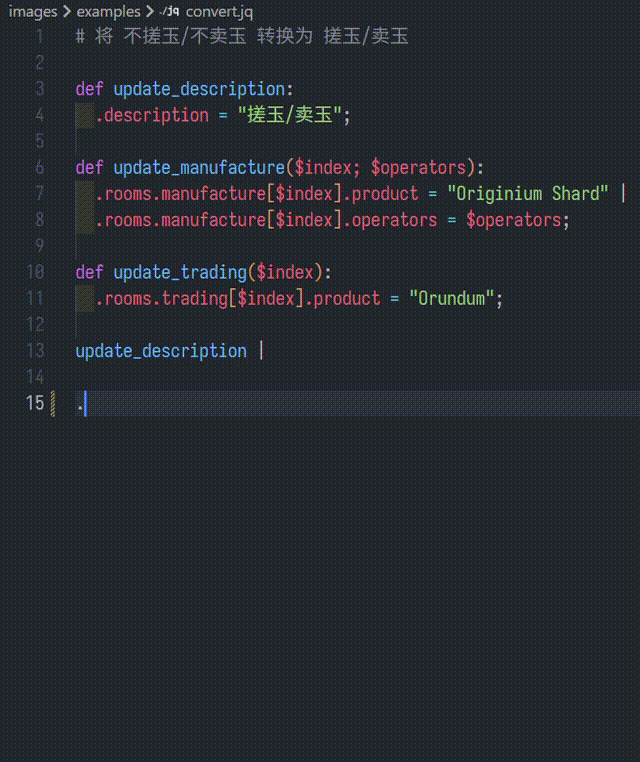

# jq-language-support

jq Language Support for VS Code

## Features

- Syntax highlighting
- Auto completion
- File icons

Syntax highlighting

Auto completion

> Color Theme is [One Dark Pro](https://marketplace.visualstudio.com/items?itemName=zhuangtongfa.Material-theme)

## Release Notes

2026-1-2 v0.0.1
